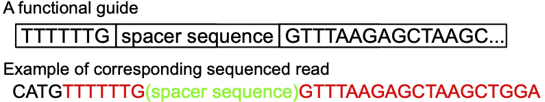

```{r echo=F}
library(reticulate)
# you need to edit RETICULATE_PYTHON in .Renviron
# for some reason I need to make a venv for each project
wd = '/Users/tim.daley/git/interviews/engineer'
python_path = paste0(wd, '/env/bin/python')
Sys.setenv(RETICULATE_PYTHON = python_path)
use_python(python_path)
#reticulate::py_config()
```

The following content is copied from a [blog post with Epic Bio](https://epicbio.medium.com/engineeringinterviewblogpost-63cccd202672)

A major and difficult problem in interviewing is how to make a practical and relevant test of the candidate's skills.  Especially for data science and software engineering, where we want to assess the candidate's reasoning skills.  The ideal problem is therefore one they have not encountered before (because then it wouldn't test their reasoning skills, but rather their memorization skills), and one that has several levels of answers.  Both are difficult to achieve, which is why a lot of companies offload this test to known solutions such as LeetCode.  

But interviews go both ways, in that not only is the company interviewing the candidate but also that the candidate is interviewing the company.  In this way, the technical test can give the candidate insight into the values of the company.  In my opinion, a generic test indicates that the company has not thought about the problems that they encounter (or will encounter).  Indeed, the company that I went with right after my postdoc impressed me tremendously with their interview, and that was the primary factor in accepting their offer.  

When it came my turn to be the interviewer I really wanted to try to make the test reflect a real problem we might encounter.  Importantly I wanted this to be a practical test, so that looking at help function or the internet (e.g. StackOverflow or BioStars) is allowed and encouraged.  And I wanted to see how the candidate works with data, so I included real data in the test.  There's an aspect of understanding the concrete characteristics of the problem when you can actually look at the input.  It's difficult to get this when the problem is presented in theory, like "imagine we had data".

Here at Epic Bio we are working on developing CRISPR-based therapies.  A problem we regularly encounter is how to process sequencing data from different types of CRISPR-based screens.  If our wet lab scientists want to use a new type of Cas protein or invent a new type of screen, then we will need some way to process the data quickly and efficiently, and as existing tools can typically only handle traditional, first-generation Cas9-based screens.  That is why I chose guide RNA (or spacer, I use the terms interchangeably) counting as the background for our technical coding exam.   In addition, there are several layers of the problem, because of the trade off between error tolerance and time complexity.  

# Problem Statement

The goal of this question is to assess the candidate's familiarity with sequence algorithms and Python programming skill.  Accordingly there are several levels to the solution of this problem.  

## Problem description

Input: 

- $3^{\prime}$ scaffold sequence: GTTTAAGAGCTAAGCTGGAAACAGCATAGCAAGTTTAAATAAGGCTAGTCCGTTATCAACTTGAAAAAGTGGCACCGAGTCGGTGCTTTTTTT;
- Promoter sequence: TTTTTTG;
- text file of spacer sequences: `guide_RNA_seq.txt`;
- fastq files of sequenced guide RNAs: `sequenced_guides.fastq`.   We can assume that we are only working with the actual sequence parts of the fastq files and ignore quality scores.

A sequenced guide RNA should (in theory) have the promoter sequence followed by the spacer sequence, then the $3^{\prime}$ scaffold sequence, flanked on other sides by other stuff. This other stuff doesn't matter but is sequenced anyways because the length of the promoter + spacer + scaffold  is much smaller than the length of a standard read. 



The goal of the problem is to produce a count of the number of times each spacer is sequenced.  Note that each sequenced read should only have one spacer.

# Data

We provide the following data:

- a text file of spacer sequences, each 20 base pairs long;
```{bash}
head guide_RNA_seq.txt
```

- fastq file of sequenced guides (simulated) that correspond to the output of the (theoretical experiment).
```{bash}
head sequenced_guides.fastq
```

```{bash}
# apparently grep color doesn't work in markdown.  It's tagging the colored sequence with '[01;31m[K'
grep --color=always -E 'GTTTAAGAGCTAAGCTGG|TTTG' sequenced_guides.fastq | head -4
```

# Solution

So the first part of finding a solution is how to read a fastq file and extract the sequences of the fastq file (since that's all we really care about).  If the candidate knows biopython, then they can use `SeqIO.read` to read in the file and then extract the sequences.  Another way is to extract every line that is 2 mod 4.  The most popular solution, and incidentally my solution, was to search the internet on how to read a fastq file.  The top result is a Biostars post (https://www.biostars.org/p/317524/) that has a clean solution and can be easily modified to only extract the sequence. 

Here's my solution based off of the above Biostars post
```{python}
import sys
import os

def process_read(lines=None):
    ks = ['name', 'sequence', 'optional', 'quality']
    return {k: v for k, v in zip(ks, lines)}

def get_sequence(fastq_file):
  # check if file exists
  if not os.path.exists(fastq_file):
      raise SystemError("Error: File does not exist.  Check spelling? ¯\_(ツ)_/¯ \n")
  
  seqs = []
  n_lines_per_record = 4
  with open(fastq_file, 'r') as fh:
    lines = []
    for line in fh:
        lines.append(line.rstrip())
        if len(lines) == n_lines_per_record:
            record = process_read(lines)
            seqs.append(record['sequence'])
            lines = []
            
  return seqs

s = get_sequence("sequenced_guides.fastq")
s[0:5]
```

## Naive solution

Once the sequences are extracted then the next step is to count.  The naive solution is to use regular expressions to search each sequence for each guide RNA (or spacer, I'll use the terms interchangeably).  This has a time complexity of $O(n \cdot m \cdot l)$, where $n$ is the number of sequenced reads, $m$ is the number of spacers, and $l$ is the length of the read.  One advantage of this approach is that you don't have to deal with processing the sequences first.  

```{python}
import re
import sys
import pandas as pd

spacer_df = pd.read_csv('guide_RNA_seq.txt', header = None, names = ['spacer'])
spacer_df['count'] = 0

fastq_file = 'sequenced_guides.fastq'
file = open(fastq_file, "r")

for line in file:
  for i in range(spacer_df.shape[0]):
    s = spacer_df['spacer'][i]
    if re.search(s, line):
      spacer_df.loc[i, 'count'] = spacer_df.loc[i, 'count'] + 1

      
spacer_df.head()
```

## Better solution

The candidate should recognize that the extra information provided helps, specifically that the spacer sequence should be flanked by promoter sequence and the scaffold sequence.  We can scan the read, look for a part of the promoter sequence then look 20 base pairs after the promoter sequence and check if that matches the scaffold sequence.  Now we have a 20 character sequence that we can match against the spacer sequences.  To make matching easy we can make a hash table of the spacer sequences, which will result in an initial cost of $O(m)$ in making the hash table and then the amortized cost of each search is $O(1)$.  Therefore the total time complexity is $O(m + n \cdot l)$.  

```{python}
import re
import sys
import pandas as pd

spacer_file = 'guide_RNA_seq.txt'
spacer_list = []
with open(spacer_file, 'r') as file:
  for line in file:
    spacer_list.append(line.rstrip())

fastq_file = 'sequenced_guides.fastq'
seqs = get_sequence(fastq_file)

scaffold_seq = 'GTTTAAGAGCTAAGCTGGA'
spacer_len = 20

spacer_dict = dict.fromkeys(spacer_list, 0)

for s in seqs:
  # find position of scaffold
  # will return -1 if not found
  scaff_pos = s.find(scaffold_seq)
  spacer_pos = scaff_pos - spacer_len
  # make sure it's valid
  if spacer_pos >= 0:
    test_spacer = s[spacer_pos:(spacer_pos + spacer_len)]
    # test if spacer is in set
    if test_spacer in spacer_dict:
      spacer_dict[test_spacer] = spacer_dict[test_spacer] + 1

# mapping rate as a check
print("mapping rate: ", sum(spacer_dict.values())/float(len(seqs)))

counts_df = pd.DataFrame(spacer_dict.items(), columns = ['seq', 'count'])
counts_df.head()
```

## Adding inexact matching

If the candidate has gotten this far then we can discuss ways to include the possibility of sequencing errors.  If we compute the full (Levenshtein) distance between the proposed spacer and each spacer in the reference, then we have to compute that for all proposed spacers against all reference spacers, which will take way too long.  One way to speed this up to restrict the edit distance to some low threshold (not more than 2) and then use the pigeonhole principle.  For example, if we restrict a match to have an edit distance of 1 and you divide the read into two halves, then one half has to match exactly.  Therefore you can build two hash tables of the two halves, and then compute the edit distance for only those reads that have at least one half matching exactly.  Another solution a candidate proposed was a tree-based algorithm, where you build a tree of the reference spacers then do a depth-first search limited to one or two mismatches.  I had not thought of that solution and was impressed the candidate could explain it to me clearly.  


# Opportunities at Epic Bio

I hope that you enjoyed the problem and description.  The Biological Data Science team here at Epic is trying build machine learning tools for the analysis of CRISPR-based screens and target identification, a field that is still in its infancy.   We're looking for  early career data scientists that might be interested in these problems, particularly with working complex data to try improve human health.  If you enjoyed this problem and you're interested in helping to build a platform for CRISPR modulation-based therapies, please take a look at the job description [posted at ISCB](https://careers.iscb.org/jobs/view/7551).