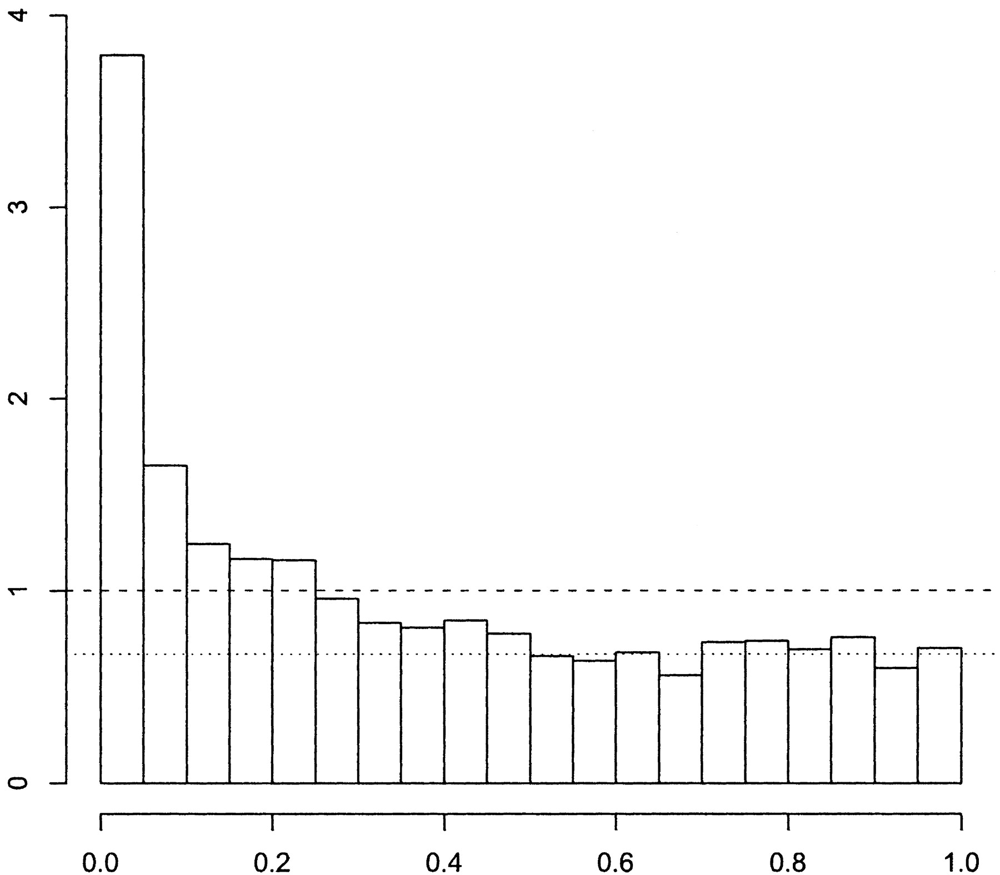
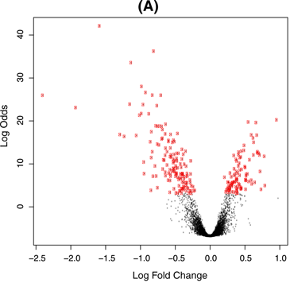
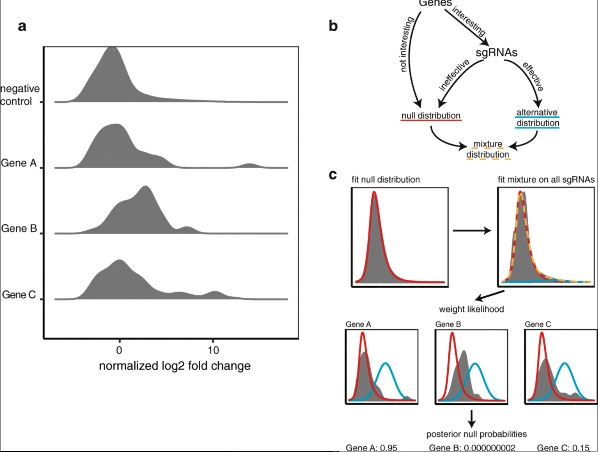

A common trope in genomics is the two groups model.  You have a large group of measurement, at least in the thousands, and usually more.  The objective of the analysis is to identify a group of "interesting" examples from the group of measurements.  Some examples:

- In standard RNA-seq analysis of a treatment vs control experiment (e.g. cancerous vs non-cancerous, drug treated vs untreated), the goal of differential expression is to identify genes that are different in the treatment compared to control under the assumption that most gene expression is unchanged between the case and control;

- In GWAS analysis the goal is to identify loci or SNPs that are different in the diseased population compared the the healthy/control populations under the assumption that most differences are small;

- In outlier identification the goal is to identify measurements that are signficantly different from the large majority of the rest of the population.

A fundamental assumptions of the two groups is that there are two groups in the set of measurements that follow different distribution and that one group makes up a large majority of the whole set.  To concretely define the two groups model we follow [Efron, 2005](https://pdfs.semanticscholar.org/93dd/1ad905da7b09568aaf7d04c3d325772d42fc.pdf).  Suppose that we have $N$ measurements with $N$ hypotheses $H_{1}, \ldots, H_{N}$.  In Efron's case the measurements were 1-dimensional but we won't restrict ourselves to this.  Denote the measurements $\boldsymbol{x}_{1}, \ldots, \boldsymbol{x}_{N}$.  The assumption that there are two groups of measurements corresponds to assuming that the distribution of the measurements is a mixture distribution, e.g. $\boldsymbol{x}_{i} \sim (1 - p) f_{0}( \boldsymbol{x}) + p f_{1}(\boldsymbol{x})$ for some small but non-zero $p$ and $f_{1}$ sufficiently different from $f_{0}$.  $p$ is the probability that a randomly chosen hypothesis is not null.  

For a given measurement $\boldsymbol{x}$ we define the local fdr as the posterior probability that the corresponding hypothesis is null as 
$$
\text{fdr}(\boldsymbol{x}) = \Pr(\text{ hypothesis } i \text{ is null } | \boldsymbol{x}) = \frac{(1 - p) f_{0}(\boldsymbol{x})}{(1 - p) f_{0}(\boldsymbol{x}) + p f_{1}(\boldsymbol{x})}.
$$
In the 1-dimensional case we usually make the assumption that the interesting cases are large positive measurements, and then we can define the global FDR of measurement $x$ as the tail area (see equation 2.7 in [Efron, 2005](https://pdfs.semanticscholar.org/93dd/1ad905da7b09568aaf7d04c3d325772d42fc.pdf))
$$
\text{FDR}(x) = \Pr (\text{ hypothesis } i \text{ is null } | X \leq x) = \frac{ (1 - p) \int_{z \leq x} f_{0} (z) dz}{(1 - p) \int_{z \leq x} f_{0} (z) dz + p \int_{z \leq x} f_{1} (z) dz}.
$$

In the multidimensional case what would we consider more extreme than a measurement $\boldsymbol{x}$?  Well naturally we would take measurements that are less null, i.e. measurements with a smaller local false discovery rate.  
$$
\text{FDR}(\boldsymbol{x}) = \frac{ (1 - p) \int_{\boldsymbol{z}: \text{fdr}(\boldsymbol{z}) \leq \text{fdr}(\boldsymbol{x})} f_{0} (\boldsymbol{z}) d \boldsymbol{z}}{(1 - p) \int_{\boldsymbol{z}: \text{fdr}(\boldsymbol{z}) \leq \text{fdr}(\boldsymbol{x})} f_{0} (\boldsymbol{z}) d \boldsymbol{z} + p \int_{\boldsymbol{z}: \text{fdr}(\boldsymbol{z}) \leq \text{fdr}(\boldsymbol{x})} f_{1} (\boldsymbol{z}) d \boldsymbol{z}}.
$$

# Examples

## $p$-values

A pretty clear example is in $p$-values, a common summary statistic of a hypothesis.  A difference here is that there is a strong theoretical null distribution if the null hyotheseses are all correctly specified, namely a $\text{Uniform}(0, 1)$.  This leads to something like the figure below taken from Figure 1 of [Storey and Tibshirani, 2003](https://www.pnas.org/content/100/16/9440.full?__hstc=31177824.2a1e835c34ab7bf88e972fdd7a7debc8.1442188800044.1442188800045.1442188800046.1&__hssc=31177824.1.1442188800047&__hsfp=1314462730).  

The non-null group can be seen as those in excess of expected under the null in the left hand tail of the distribution.  The known null allows for easy estimation of $p$ and $f_{1}$.  

## Differential expression

In differential expression analysis we assume that after normalization most gene effects are zero, then we look for log fold changes that are significantly different from 0.  This is shown below, taken from Figure 4 in [Ritchie et al, 2015](https://academic.oup.com/nar/article/43/7/e47/2414268).  The red points are the genes that were identified as significantly different from zero.

## High throughput screening for drug discovery

High throughput screening is usually the first step in identifying possible targets for druggable molecules, e.g. [Hughes et al, 2011](https://www.ncbi.nlm.nih.gov/pmc/articles/PMC3058157/).   A large swath of molecules are assayed and measured for particular chemical properties, such as binding to a desired molecule.  Then the outliers in the desired direction are chosen as possible hits for further in depth investigation, e.g. [Shaby et al, 2016](https://www.ncbi.nlm.nih.gov/pmc/articles/PMC4965338/). 

## Pooled CRISPR screens

The primary motivating application of the two groups model for me is pooled CRISPR screens.  In such screens thousands of genes or loci are perturbed with CRISPRko (knockout), CRISPRi (inhibition), or CRISPRa (activation), and then selected for some phenotype.  The genes with significant changes (positive or negative, depending on the application) from the rest are likely to be associated with the desired phenotype and are chosen for further investigation.  One difference in this application is that there are several measurements per gene and these can show high variability in their effects, even for known positive hits.  This lead me to suggest a hierarchical two groups model, shown below.

